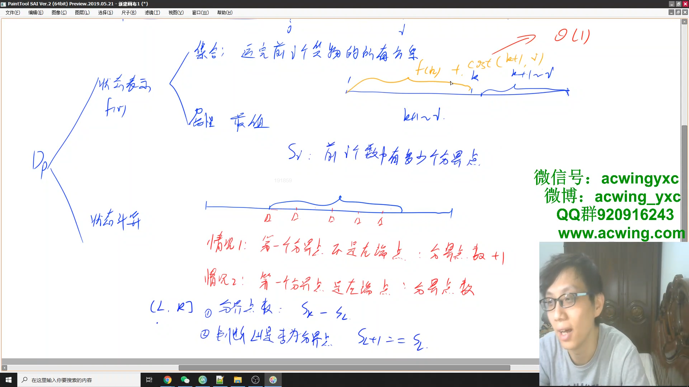
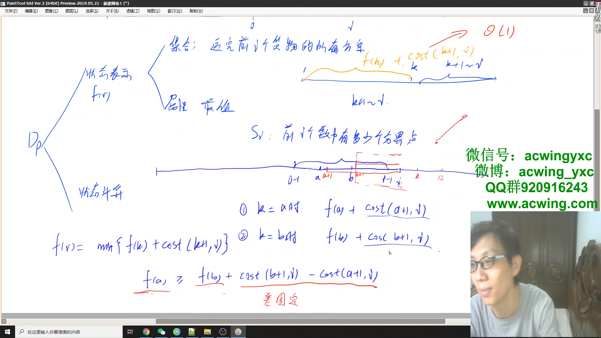
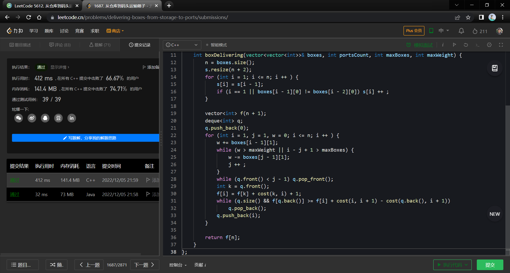

#### <a href="https://leetcode.cn/problems/delivering-boxes-from-storage-to-ports/">从仓库到码头运输箱子</a>

-----------

##### 闫氏dp分析法

- 状态表示 $f(i)$

  - 集合：运完前 $i$ 个货物的所有方案
  - 属性：最少行程数

- 状态计算

  将集合分为若干个不重不漏的子集，每个子集分别求最小值，那么集合的最小值就是每个子集的最小值取min

  划分子集的时候一般找最后一个不同点，这里考虑最后一批运的货物是哪一批，**这里的批其实是箱子数组的一段区间**

  因为卡车有两个限制，所以定于 $j$ 为最后一批的左端点最多可以到哪（即如果取 $j - 1$ 就超出限制了）

  根据整个规则，我们可以根据最后一批的左端点的取值划分子集为：
  $$
  j - i,\ j + 1 - i,\ j + 2 - i\ ...\ i - i
  $$
  不失一般性，考虑其中的某一个集合：$k + 1 - i$ ，根据定义，该集合的最小值为
  $$
  f(k) + cost(k + 1 , i)
  $$
  $cost(k+1,i)$ 表示卡车装载 $[k + 1, i]$ 的箱子，将所有的箱子运输完需要的行程数量

  这样做的时间复杂度是 $O(n^2)$ 的

  **优化**

  **考虑 $cost$ 的计算**

  - 问题转换

    比如要运输区间 $[i, j]$，根据区间里每个箱子的码头不同，分为 $x$ 段，那么 $cost(i, j) = x + 1$

    那么现在问题就转换为：如何在一个连续的区间里，快速的求出该区间可以分为多少段（也即是 $x$）

  - 使用前缀和

    考虑区间内有多少个分界点（该点与前一个点的元素不同）

    

  优化之后，求 $cost(i, j)$ 的时间复杂度就是 $O(1)$ 的

  **进一步优化**

  上述优化之后 $k$ 还是要枚举，还是 $O(n^2)$ 的

  **单调队列优化**

  

------------

```java
class Solution {

    int n;
    int[] s; // 前缀和数组

    public int boxDelivering(int[][] boxes, int portsCount, int maxBoxes, int maxWeight) {
        this.n = boxes.length;

        // 预处理前缀和数组，表示前 i 个数中有多少个分界点
        s = new int[n + 2];
        for (int i = 1; i <= n; i ++) {
            s[i] = s[i - 1];
            if (i == 1 || boxes[i - 1][0] != boxes[i - 2][0]) s[i] ++;
        }

        Deque<Integer> queue = new ArrayDeque<>();
        int[] f = new int[n + 1]; // f[i] 表示运输前 i 个箱子需要的最少行程数
        queue.push(0); // f(0) 也是一种方案
        for (int i = 1, j = 1, w = 0; i <= n; i ++) {

            // 双指针维护运输最后一批箱子是不超出限制的
            w += boxes[i - 1][1];
            while (w > maxWeight || i - j + 1 > maxBoxes) {
                w -= boxes[j - 1][1];
                j ++;
            }
            while (queue.peekFirst() < j - 1) queue.pollFirst(); // 将队列里超出限制的删去

            // 状态转移
            int k = queue.peekFirst(); // 队头元素是当前最佳的 k 点
            f[i] = f[k] + cost(k, i) + 1; // cost函数是左开右闭的，这里 k 取不到，所以不是 k + 1。加 1 是加上返程

            // 维护队列里单调递增（按照 k 的取值对行程数进行排序），即维护队头是当前最佳的 k 点
            while (!queue.isEmpty() && f[queue.peekLast()] >= f[i] + cost(i, i + 1) - cost(queue.peekLast(), i + 1)) // 这里cost右端点只需要保证比左端点大，因为取的是差值
                queue.pollLast();
            queue.addLast(i);
        }
        return f[n];
    }

    // 计算区间 (l, r] 有多少分界点
    public int cost(int l, int r) {
        if (s[l] != s[l + 1]) return s[r] - s[l];
        return s[r] - s[l] + 1;
    }
}
```

对于这题来说，java居然比c++快那么多？



